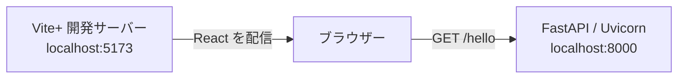
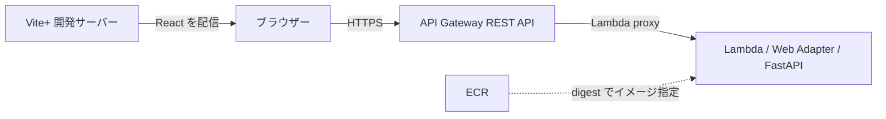

# React / API Gateway Sandbox

## このプロジェクトで検証すること

React から API を呼び出し、正常時とエラー時の CORS の挙動を検証する PoC です。

- 現在: React と FastAPI の疎通、基本的な CORS、通信失敗からの再試行、コンテナ実行と構造化ログ、Terraform による ECR 作成・イメージ push と、Lambda / REST API 上の Hello World を確認。
- 今後: Amplify Hosting、Gateway・Lambda 統合の障害、エラー時 CORS を検証。
- 開発・実行手順: 各ディレクトリの README に記載。

## 現在の構成

### ローカルの通信経路

ブラウザーから別 Origin の FastAPI を直接呼び出します。

- フロントエンド: React + TypeScript 7 + Vite+。
- バックエンド: FastAPI + Uvicorn。
- コンテナ: Lambda Web Adapter を同梱した `linux/amd64` イメージ。ローカルでは Uvicorn に直接アクセス。
- ログ: Powertools for AWS Lambda による JSON ログ。
- ブラウザーテスト: Playwright / Chromium。
- Vite プロキシ: 使用せず、別 Origin の通信を検証。

### AWS の通信経路

ローカルの React から、AWS 上の REST API を呼び出します。

- 配信: 現在はローカル Vite。Amplify Hosting は未追加。
- IaC: ECR と API を別の Terraform state で管理。
- API と Lambda: SSO プロファイルのリージョンを使用。
- 認証と credentials: 未導入。

## 検証済みの PoC

### React と FastAPI の疎通

画面から実 API を呼び、結果を表示できることを確認しています。

| 検証内容 | 確認できたこと | 検証方法 |
| --- | --- | --- |
| Hello World API | `GET /hello` が `200` と `{"message":"Hello World"}` を返す | API テスト |
| ブラウザーからの呼び出し | React が API の結果を取得し、`API: Hello World` を表示する | Playwright |
| 通信失敗と再試行 | エラーを表示し、接続回復後に同じボタンから再試行できる | Playwright |

### 基本的な CORS

許可 Origin の通信と、未許可 Origin に対するレスポンスヘッダーを確認しています。

| 検証内容 | 確認できたこと | 検証方法 |
| --- | --- | --- |
| 許可 Origin | `http://localhost:5173` に許可ヘッダーを返し、ブラウザーから本文を読める | API テスト / Playwright |
| 未許可 Origin | `http://localhost:9999` に `Access-Control-Allow-Origin` を付けない | API テスト |
| credentials | 許可レスポンスに `Access-Control-Allow-Credentials` を付けない | API テスト |

### コンテナと構造化ログ

同じ API をコンテナで実行し、リクエスト単位でログを確認できることを検証しています。

| 検証内容 | 確認できたこと | 検証方法 |
| --- | --- | --- |
| OS パッケージ更新 | 共通 OS ステージで更新し、再ビルドでも更新処理を実行する | Docker ビルド・パッケージ確認 |
| イメージのビルド | 独立スクリプトで digest 固定の `linux/amd64` イメージを作成できる | Docker ビルド |
| コンテナからの疎通 | React からコンテナ内の API を呼び、通信失敗後の再試行もできる | Playwright |
| Lambda 向けの配置 | Web Adapter の実行ファイルを同梱し、テスト依存を含めない | コンテナ内の確認 |
| 実行権限と同梱物 | 非 root で実行し、実行イメージに uv・テスト依存を含めない | コンテナ内の確認 |
| 読み取り専用での実行 | `/tmp` を用意した読み取り専用コンテナで API が動く | コンテナ起動・HTTP 疎通 |
| JSON ログ | HTTP と Uvicorn 起動ログを JSON として読み取れる | コンテナログの確認 |
| リクエストの識別 | ステータス・処理時間・相関 ID を記録し、同時リクエストで混同しない | API テスト |
| 例外の記録 | テスト用 API の未処理例外を ERROR ログに記録し、500 を返す | API テスト |
| 記録するデータ | 本文・クエリ文字列・認証ヘッダーをログに含めない | API テスト |

### ECR とイメージの登録

ECR の作成と Docker イメージの push を分離して実行できることを確認しています。

| 検証内容 | 確認できたこと | 検証方法 |
| --- | --- | --- |
| ECR 専用の IaC | ECR 1件を独立した Terraform state で作成できる | plan / apply |
| 再適用の差分 | 作成後の plan が変更なしになる | Terraform |
| リポジトリ設定 | immutable タグ、push 時のスキャン、AES256 暗号化が設定される | AWS CLI |
| イメージ登録 | 独立スクリプトで push し、digest URI を取得できる | Docker / AWS CLI |
| 入力と終了処理 | 不正タグ・異なるアーキテクチャを拒否し、成功・失敗時に一時認証設定を削除する | ローカルテスト |
| 脆弱性スキャン | 初回イメージのスキャン完了と検出内容を確認できる | ECR basic scanning |

初回スキャン（2026-10-04）は Critical 3件・High 13件・Medium 7件・Low 2件を検出しています。Critical はベースイメージ内の Perl に関する検出で、イメージ更新による解消は未検証です。

### Lambda と REST API

Lambda 上の Web Adapter を経由し、React から Hello World を取得できることを確認しています。

| 検証内容 | 確認できたこと | 検証方法 |
| --- | --- | --- |
| digest 指定 | push の出力を plan へ渡し、Lambda の実行 digest が一致する | Terraform / AWS CLI |
| Terraform の適用 | API 関連13リソースを追加し、再 plan で差分がない | plan / apply |
| Web Adapter | 拡張機能が起動し、REST API のイベントを FastAPI へ渡せる | Playwright / CloudWatch |
| ブラウザー疎通 | ローカル React が AWS の API を呼び、結果を表示する | Playwright |
| CORS と再試行 | 許可 Origin の通信と、通信失敗後の回復を確認できる | Playwright |
| 起動ログ | Uvicorn の起動ログを CloudWatch 上で JSON として取得できる | ログ解析 |
| Request ID | HTTP ログの Lambda ID がプラットフォームログの ID と一致する | ログ解析 |

Gateway 自身のエラー時 CORS、広範囲の障害、Amplify 上のブラウザー疎通は未検証です。

## 今後の検証対象

以下は、まだ検証していない構成と動作です。

- イメージ: スキャンで検出した脆弱性への対応と再スキャン。
- 配信: Amplify Hosting と手動デプロイ。
- エラー時 CORS: アプリの4xx・5xx、Gateway と Lambda 統合の障害。
- 追加検討: 認証方式と credentials を含む CORS。

## 開発・実行手順への案内

操作する対象の README を参照してください。コマンドは各ディレクトリ内で実行します。

- [frontend](frontend/README.md): 開発環境、画面の起動、API URL の設定、型検査・ビルド。
- [backend](backend/README.md): 開発環境、API・コンテナの起動、構造化ログ、API テスト。
- [infra](infra/README.md): ECR 専用 Terraform、認証と state の管理。
- [e2e](e2e/README.md): 通常・コンテナのブラウザーテスト、画面キャプチャ・トレース確認。

まず frontend と backend のセットアップ・疎通を確認し、ブラウザーでの自動検証には e2e の手順を使用してください。
