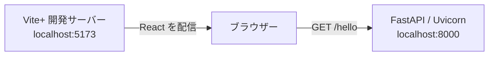
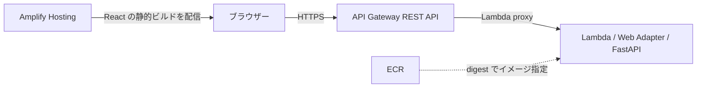

# React / API Gateway Sandbox

## 目次

- [このプロジェクトで検証すること](#このプロジェクトで検証すること)
- [現在の構成](#現在の構成)
- [PoC の概要](#poc-の概要)
- [今後の検証対象](#今後の検証対象)
- [開発・実行手順への案内](#開発実行手順への案内)

## このプロジェクトで検証すること

React から API を呼び出し、正常時とエラー時の CORS の挙動を検証する PoC です。

- 現在: ローカルと Amplify Hosting の React から、AWS API の正常応答・アプリのエラー時 CORS を検証。
- 今後: Gateway・Lambda 統合の障害時 CORS を検証。
- 開発・実行手順: 各ディレクトリの README に記載。

## 現在の構成

### ローカルの通信経路

ブラウザーから別 Origin の FastAPI を直接呼び出します。

- フロントエンド: React + TypeScript 7 + Vite+。
- バックエンド: FastAPI + Uvicorn。
- コンテナ: Lambda Web Adapter を同梱した `linux/amd64` イメージ。ローカルでは Uvicorn に直接アクセス。
- ログ: Powertools for AWS Lambda による JSON ログ。
- ブラウザー・HTTP 結合テスト: Playwright。画面操作は Chromium を使用。
- Vite プロキシ: 使用せず、別 Origin の通信を検証。

### AWS の通信経路

Amplify Hosting の React から、別 Origin の REST API を直接呼び出します。

- 配信: Amplify Hosting。ビルドと手動デプロイは独立スクリプト。
- IaC: ECR と app を別 state で管理。app は API・Hosting・関連権限とログを統合。
- API と Lambda: SSO プロファイルのリージョンを使用。
- 認証と credentials: 未導入。

## PoC の概要

検証済みの内容は [PoC の検証結果](docs/poc.md)にまとめています。

- React / FastAPI: Hello World の表示と通信失敗後の再試行。
- CORS: 正常・エラー応答の読み取り、未許可 Origin・プリフライトの拒否、credentials 不許可。
- コンテナ: OS 更新、非 root 実行、構造化ログ。
- ECR: 独立した Terraform、イメージ push と digest 取得。
- AWS API: Lambda / REST API の疎通と CloudWatch の Request ID 照合。
- Hosting: 手動デプロイ、静的配信・SPA の直接アクセス、配信先 Origin の CORS。

## 今後の検証対象

以下は、まだ検証していない構成と動作です。

- イメージ: スキャンで検出した脆弱性への対応と再スキャン。
- エラー時 CORS: Gateway 自身が返すエラーと Lambda 統合の障害。
- 追加検討: 認証方式と credentials を含む CORS。

## 開発・実行手順への案内

操作する対象の README を参照してください。コマンドは各ディレクトリ内で実行します。

- [frontend](frontend/README.md): 開発環境、画面の起動、API URL の設定、型検査・ビルド、Amplify への手動デプロイ。
- [backend](backend/README.md): 開発環境、API・コンテナの起動、構造化ログ、API テスト。
- [infra](infra/README.md): ECR と app の Terraform、認証と state の管理。
- [e2e](e2e/README.md): ローカル・コンテナ・AWS・Hosting のブラウザー／HTTP 結合テスト、画面キャプチャ・トレース確認。

まず frontend と backend のセットアップ・疎通を確認し、ブラウザーでの自動検証には e2e の手順を使用してください。
