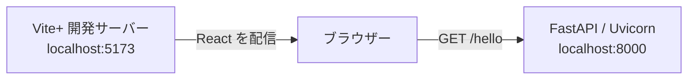

# React / API Gateway Sandbox

## このプロジェクトで検証すること

React から API を呼び出し、正常時とエラー時の CORS の挙動を検証する PoC です。

- 現在: ローカルの React と FastAPI の疎通、基本的な CORS、通信失敗からの再試行を確認。
- 今後: Amplify Hosting、API Gateway REST API、Lambda Web Adapter を含む構成へ拡張。
- 開発・実行手順: 各ディレクトリの README に記載。

## 現在の構成

### ローカルの通信経路

ブラウザーから別 Origin の FastAPI を直接呼び出します。

- フロントエンド: React + TypeScript 7 + Vite+。
- バックエンド: FastAPI + Uvicorn。
- ブラウザーテスト: Playwright / Chromium。
- Vite プロキシ: 使用せず、別 Origin の通信を検証。

## 検証済みの PoC

### React と FastAPI の疎通

画面から実 API を呼び、結果を表示できることを確認しています。

| 検証内容 | 確認できたこと | 検証方法 |
| --- | --- | --- |
| Hello World API | `GET /hello` が `200` と `{"message":"Hello World"}` を返す | API テスト |
| ブラウザーからの呼び出し | React が API の結果を取得し、`API: Hello World` を表示する | Playwright |
| 通信失敗と再試行 | エラーを表示し、接続回復後に同じボタンから再試行できる | Playwright |

### 基本的な CORS

許可 Origin の通信と、未許可 Origin に対するレスポンスヘッダーを確認しています。

| 検証内容 | 確認できたこと | 検証方法 |
| --- | --- | --- |
| 許可 Origin | `http://localhost:5173` に許可ヘッダーを返し、ブラウザーから本文を読める | API テスト / Playwright |
| 未許可 Origin | `http://localhost:9999` に `Access-Control-Allow-Origin` を付けない | API テスト |
| credentials | 許可レスポンスに `Access-Control-Allow-Credentials` を付けない | API テスト |

現在の検証はローカルの正常レスポンスと通信失敗が中心です。エラーレスポンスの CORS と AWS 上の統合は、今後の検証対象です。

## 今後の検証対象

AWS 上の構成を追加し、PoC の結果をこの README に追記していきます。

- コンテナ: Lambda Web Adapter + FastAPI、Powertools の構造化ログ。
- AWS API: ECR、Lambda、API Gateway REST API、Terraform による構成管理。
- 配信: Amplify Hosting と手動デプロイ。
- エラー時 CORS: アプリの4xx・5xx、Gateway と Lambda 統合の障害。
- 追加検討: 認証方式と credentials を含む CORS。

## 開発・実行手順への案内

操作する対象の README を参照してください。コマンドは各ディレクトリ内で実行します。

- [frontend](frontend/README.md): 開発環境、画面の起動、API URL の設定、型検査・ビルド。
- [backend](backend/README.md): 開発環境、API の起動、CORS 設定、API テスト。
- [e2e](e2e/README.md): テスト環境、Playwright の実行、失敗時のトレース確認。

まず frontend と backend のセットアップ・疎通を確認し、ブラウザーでの自動検証には e2e の手順を使用してください。
