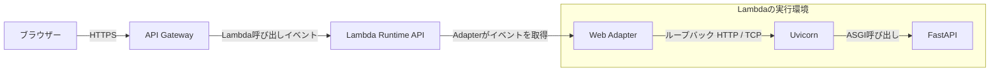
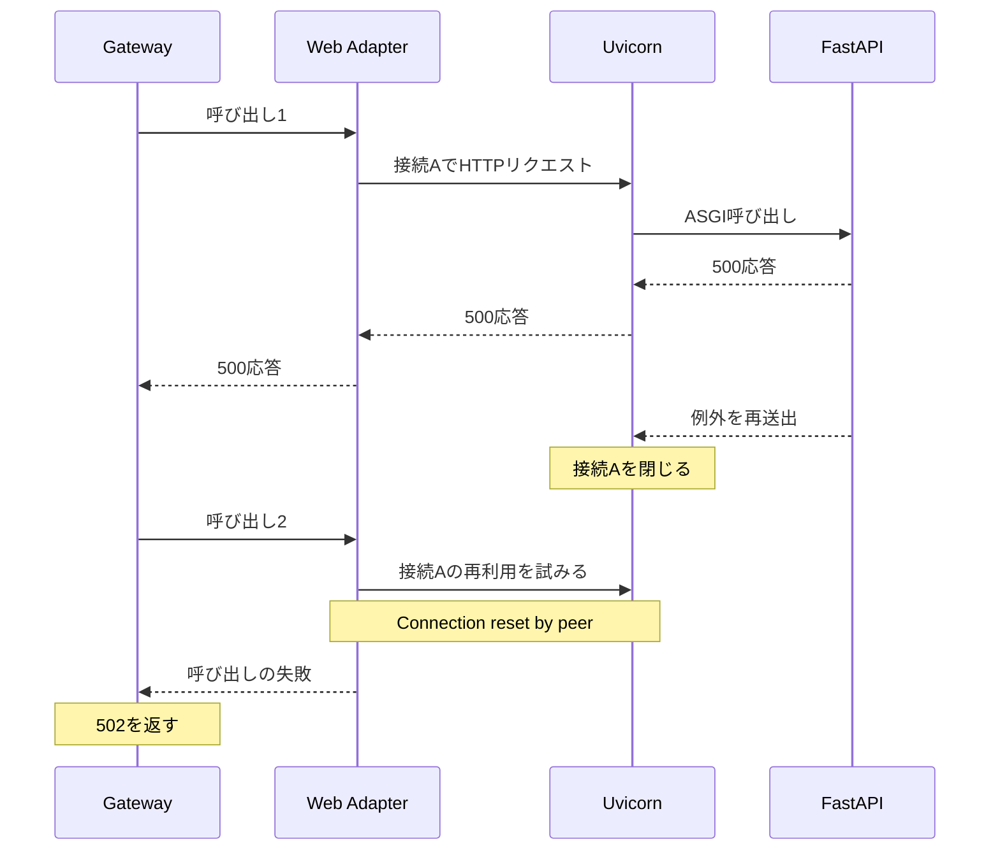
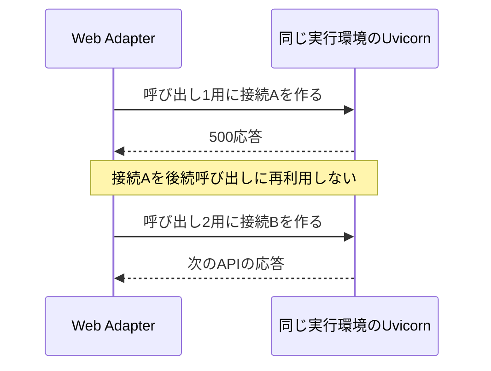

# Web Adapter と Uvicorn の接続再利用

## 結論

この PoC では、未処理500後の接続リセットを避けるため、Web Adapter から Uvicorn への HTTP 接続再利用を無効にしています。Lambda の実行環境を毎回作り直す設定ではありません。

- 設定: `AWS_LWA_POOL_IDLE_TIMEOUT_SECONDS=0`。
- 同じ Lambda 実行環境とアプリプロセスは、AWS の判断で再利用できます。
- 毎回作るのは、同じ実行環境内のループバック TCP 接続です。
- 本番での採用は別途判断。追加コストは未測定で、数十ミリ秒以内とは断定できません。
- 実装: [infra/api/main.tf](../infra/api/main.tf)。観測内容: [PoC の記録](poc.md#aws-で観測した接続再利用の問題)。

## 通信経路と再利用する対象

Gateway の Lambda 呼び出しイベントを、Adapter がローカル HTTP リクエストへ変換します。

| 対象 | 再利用の意味 | 今回の変更 |
| --- | --- | --- |
| Lambda 実行環境 | 初期化済み環境を後続呼び出しにも使う | 無効化していない。再利用の可否は AWS が決定 |
| Uvicorn／FastAPI プロセス | 初期化済みアプリを動かし続ける | 毎回起動する設定にはしていない |
| Adapter → Uvicorn の接続 | 前回使った HTTP 接続をプールから取り出す | この再利用を無効化 |

- 図の矢印はリクエストの経路を示し、応答経路は省略しています。
- Gateway が Uvicorn の8080番ポートへ直接接続する構成ではありません。
- この接続は HTTP。TLS ハンドシェイクや外部ネットワーク通信は伴いません。
- コールドスタートが起きることはありますが、この設定が毎回のコールドスタートを要求するわけではありません。

根拠: [Web Adapter の構成と設定](https://github.com/aws/aws-lambda-web-adapter/blob/v1.1.0/README.md#configurations)、[Lambda の実行環境](https://docs.aws.amazon.com/lambda/latest/dg/lambda-runtime-environment.html)。

## 未処理500の後に何が起きたか

未処理500を返した直後、別の API 呼び出しが FastAPI に届く前に502になる現象を観測しました。

- 確認した事実: Adapter に `Connection reset by peer` が記録され、失敗した呼び出しの FastAPI HTTP ログはありませんでした。
- コードで確認した動作: 使用している Uvicorn は、応答開始後に ASGI アプリから例外を受けると接続を閉じます。
- 原因の判断: 閉じた接続の再利用と整合します。ただし、プール内部の接続選択や正確なタイミングまで計測したわけではありません。図はこの判断に基づく説明です。
- 対処後の確認: 接続再利用を無効にすると、未処理500・応答検証500・400を連続して読み取れ、その後の正常応答も取得できました。

`Exception` の包括ハンドラーで独自の500本文を返しても、元の例外は再送出されます。ハンドラーを追加するだけでは接続を閉じる条件はなくなりません。詳しくは [例外ハンドラーの処理場所と限界](cors.md#exception_handler-で500を統一しても再送出は残る)を参照してください。

500というステータスだけで常に起きる現象ではありません。`HTTPException(status_code=500)` は処理済みの応答で、今回問題になったのは Uvicorn まで例外が再送出されるケースです。

Uvicorn の参照: [使用バージョンの h11 実装](https://github.com/encode/uvicorn/blob/0.54.0/uvicorn/protocols/http/h11_impl.py)。

## 接続再利用を無効にした場合

後続呼び出しでは、同じ実行環境内に新しい接続を作ります。

- Adapter v1.1.0 は `AWS_LWA_POOL_IDLE_TIMEOUT_SECONDS=0` で接続再利用を無効化します。
- アプリの例外再送出と ERROR ログは維持します。
- 毎回の TCP 接続確立・終了などの処理が増えます。
- この PoC はエラーの安定した再現を優先した判断です。本番でも必ずこの値にする方針ではありません。

## 本番採用時に比較すること

接続が同じ実行環境内でも、追加コストの上限は実測なしでは決められません。

- 同じイメージ・メモリ・リクエスト内容で、接続再利用の有無を比較する。
- コールドスタートと、初期化済み環境での呼び出しを分ける。
- 正常応答の応答時間・p50／p95／p99、処理量を比較する。
- 未処理500後の連続呼び出しと、間隔を空けた呼び出しで失敗率を確認する。
- ブラウザーからの応答時間には Gateway と外部ネットワークも含まれるため、全体の差と Adapter → Uvicorn の接続コストを区別する。
- `duration_ms` は FastAPI に到達してからの計測なので、それだけでは接続確立コストを測れない。

追加コストが許容範囲で、失敗率の改善が必要なら、本番でも採用する選択肢になります。この PoC では性能比較は未実施です。

## 応答後のログ遅延は別の確認事項

接続再利用の無効化は、ログの即時出力を保証する対処ではありません。

- 未処理500の ERROR ログが後続呼び出しの後に確認できるケースも観測しました。
- Lambda の停止と後処理の再開に整合しますが、停止時点は未測定で、CloudWatch の配信遅延も含み得ます。
- 処理時間は最終本文を送る直前に保存し、後続呼び出しまでの待機を含めないようにしています。
- この計測はクライアントが応答を受信し終わるまでの時間ではありません。
- 詳細: [ログ出力遅延の観測と限界](poc.md#aws-で観測したログ出力の遅延)。

## まとめ

- 無効にしたのは、Adapter と Uvicorn 間の HTTP 接続再利用です。
- Lambda の実行環境やアプリを毎回起動し直す設定ではありません。
- 未処理500後の失敗を避ける回避策として、この PoC で採用しています。
- 本番採用は、追加コストと失敗率を比較して判断します。
