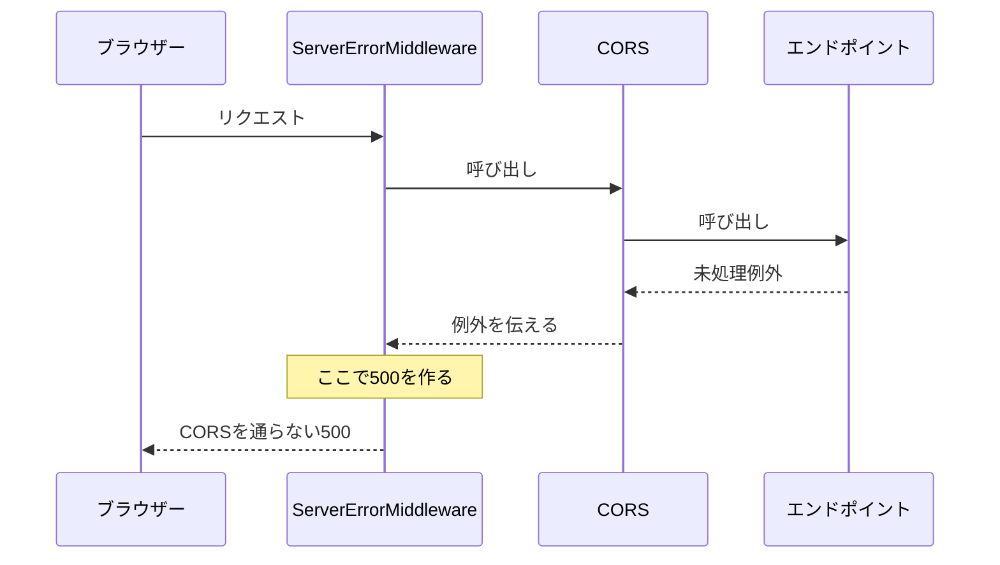
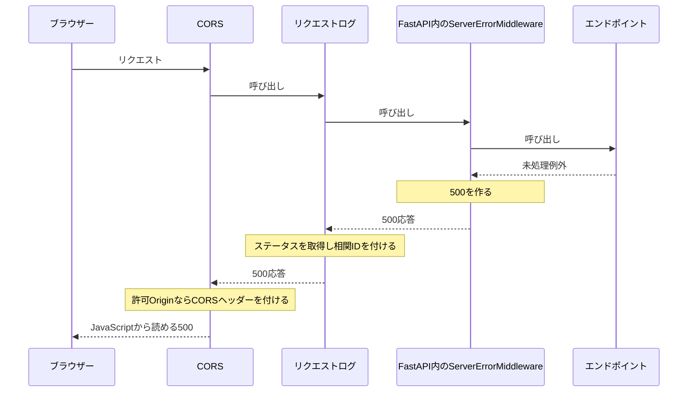

# エラー応答にも CORS を適用する理由

## 結論

未処理例外の500をブラウザーから読めるようにするには、500を生成する処理も含めて FastAPI 全体を CORS で包みます。

- 現在の順序: CORS → リクエストログ → FastAPI。
- `add_middleware` は利用可能。ただし、追加したミドルウェアは FastAPI 内部の500生成処理より内側に置かれます。
- Origin の許可と、JavaScript に公開するレスポンスヘッダーの指定は別の設定です。
- 実装: [backend/app/main.py](../backend/app/main.py)。操作: [backend README](../backend/README.md#エラーレスポンスの-cors-検証)。

## FastAPI が持つ2種類のエラー処理

FastAPI は Starlette を使い、内部にエラー処理を持っています。

| エラー | 応答を作る処理 | 今回の例 |
| --- | --- | --- |
| 処理済みの HTTP エラー | ルーティングや例外ハンドラー | 404・405・422、`HTTPException(status_code=500)` |
| 未処理例外 | 外側の `ServerErrorMiddleware` | `RuntimeError`、レスポンス検証エラーによる500 |

- どちらも HTTP エラーですが、応答を作る位置が異なります。
- 未処理例外は500を送った後も再送出されるため、外側のログ処理でも例外を観測できます。
- 図では説明に必要な層だけを示し、ルーティングなどの詳細は省略しています。

## add_middleware だけでは未処理500に届かない

`api.add_middleware(CORSMiddleware, ...)` では、500生成処理が CORS より外側になります。



- 通常の応答は CORS を通って戻るため、許可ヘッダーが付きます。
- 未処理500は外側で生成され、内側の CORS を通って戻りません。
- 許可 Origin からの通信でも、ブラウザーはこの500本文を JavaScript に公開できません。

このため、正常系だけの確認では配置の問題を見落とせます。

## 現在の配置では500も CORS を通る

CORS とログを、FastAPI の外側に配置します。



- 図は500応答の経路です。その後の例外再送出と ERROR ログは省略しています。
- 未許可 Origin には `Access-Control-Allow-Origin` を付けません。
- CORS が直接応答するプリフライトは、ログと FastAPI を呼び出しません。
- Gateway 自身が生成するエラーは FastAPI を通らないため、この配置では対処できません。

この「500生成処理よりも外側に置く」ことが、Starlette の CORS 全体適用の意味です。
根拠: [Starlette のミドルウェアと CORS 全体適用](https://starlette.dev/middleware/#corsmiddleware-global-enforcement)。

## 複数のミドルウェアを追加する場合

通常のミドルウェアは FastAPI に追加し、最後に全体を包めます。

```python
api = FastAPI()
# 必要なミドルウェアを api.add_middleware(...) で追加する。

logged_app = RequestLoggingMiddleware(api)
cors_app = CORSMiddleware(logged_app, allow_origins=["http://localhost:5173"])
```

- `api`: ルートや FastAPI 内部のミドルウェアを登録する対象。
- `logged_app`: FastAPI 全体を包み、内部で生成した500も観測する対象。
- `cors_app`: Uvicorn に渡す、最も外側のアプリ。
- さらに外側へ層を追加することも可能。その層が独自の応答を返すなら、CORS を通る配置か確認します。

変数を分けることで、追加順序と適用範囲をコードから追えます。

## expose_headers と Retry-After

別 Origin の通信では、ヘッダーがネットワーク上に存在することと、JavaScript から読めることは別です。

```http
Access-Control-Expose-Headers: X-Request-Id, Retry-After
Retry-After: 1
```

- `expose_headers`: `Access-Control-Expose-Headers` を生成する FastAPI／Starlette の設定。
- `X-Request-Id`: 公開指定がなければ、別 Origin の `response.headers.get('X-Request-Id')` は `null`。開発者ツールでは見える場合があります。
- `Retry-After`: 再試行までの待ち時間を示すレスポンスヘッダー。`1` は1秒待つ指示です。秒数のほか、HTTP 日付も指定できます。
- `Content-Type` などは標準で読み取り可能ですが、この2つは明示的な公開が必要です。
- 同じ Origin の通信では、この公開指定は不要です。
- 今回は429に待機時間を付けて表示する検証。実際のレート制限や自動再試行は実装していません。

根拠: [Fetch の公開ヘッダーの仕様](https://fetch.spec.whatwg.org/#cors-safelisted-response-header-name)、[HTTP の Retry-After の仕様](https://www.rfc-editor.org/rfc/rfc9110.html#name-retry-after)。

## まとめ

- 未処理500がどこで生成されるかを確認し、その外側に CORS を配置します。
- ログも外側に配置することで、実際の500ステータスと相関 ID を観測します。
- Origin の許可、プリフライトの許可、レスポンスヘッダーの公開はそれぞれ別の制御です。
- 検証した範囲は [PoC の記録](poc.md#アプリのエラー時-cors)を参照してください。
