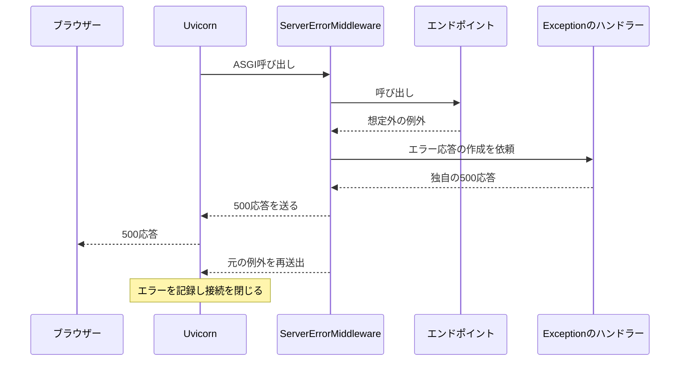
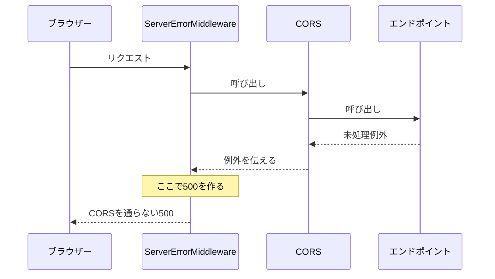
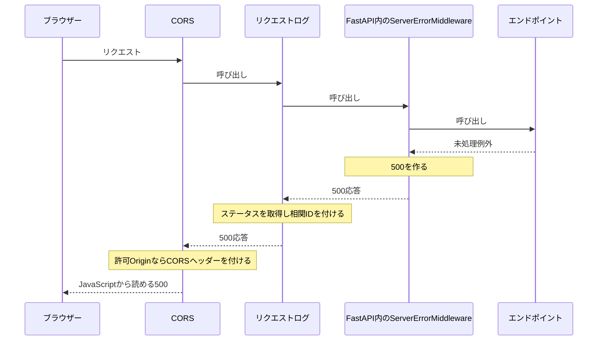

# エラー応答にも CORS を適用する理由

## 目次

- [結論](#結論)
- [FastAPI が持つ2種類のエラー処理](#fastapi-が持つ2種類のエラー処理)
- [exception_handler で500を統一しても再送出は残る](#exception_handler-で500を統一しても再送出は残る)
- [add_middleware だけでは未処理500に届かない](#add_middleware-だけでは未処理500に届かない)
- [現在の配置では500も CORS を通る](#現在の配置では500も-cors-を通る)
- [複数のミドルウェアを追加する場合](#複数のミドルウェアを追加する場合)
- [expose_headers と Retry-After](#expose_headers-と-retry-after)
- [まとめ](#まとめ)

## 結論

未処理例外の500をブラウザーから読めるようにするには、500を生成する処理も含めて FastAPI 全体を CORS で包みます。

- 現在の順序: CORS → リクエストログ → FastAPI。
- `add_middleware` は利用可能。ただし、追加したミドルウェアは FastAPI 内部の500生成処理より内側に置かれます。
- Origin の許可と、JavaScript に公開するレスポンスヘッダーの指定は別の設定です。
- 実装: [backend/app/main.py](../backend/app/main.py)。操作: [backend README](../backend/README.md#エラーレスポンスの-cors-検証)。

## FastAPI が持つ2種類のエラー処理

FastAPI は Starlette を使い、内部にエラー処理を持っています。

| エラー | 応答を作る処理 | 今回の例 |
| --- | --- | --- |
| 処理済みの HTTP エラー | ルーティングや例外ハンドラー | 404・405・422、`HTTPException(status_code=500)` |
| 未処理例外 | 外側の `ServerErrorMiddleware` | 個別ハンドラーを登録していない `RuntimeError`、レスポンス検証エラーによる500 |

- どちらも HTTP エラーですが、応答を作る位置が異なります。
- 未処理例外は500を送った後も再送出されるため、外側のログ処理でも例外を観測できます。
- 図では説明に必要な層だけを示し、ルーティングなどの詳細は省略しています。

## exception_handler で500を統一しても再送出は残る

`exception_handler` はエラー応答の本文を統一するために使えます。ただし、`Exception` を登録した包括ハンドラーは、応答後の例外再送出を止める仕組みではありません。

### 登録する対象による違い

| 登録対象 | 主な処理場所 | ハンドラーが正常に応答を返した後 |
| --- | --- | --- |
| `HTTPException` やアプリ固有の例外クラス | 内側の `ExceptionMiddleware` | 応答開始前に処理できれば、通常は再送出しない |
| `Exception` またはステータスコード `500` | 外側の `ServerErrorMiddleware` | 元の例外をサーバーまで再送出する |

- `Exception` は外側の500用ハンドラーとして特別に扱われます。
- HTTPException や入力検証エラーには既定のハンドラーがあるため、`Exception` の登録だけですべてのエラー本文が置き換わるわけではありません。
- 想定した業務エラーは個別の例外クラスで扱い、想定外のエラーは包括ハンドラーで本文を統一する、と役割を分けられます。
- この節は実装方法の説明です。現在のアプリへ新しい例外ハンドラーを追加したものではありません。

### 包括ハンドラーで応答を作る例

```python
from fastapi import Request
from fastapi.responses import JSONResponse


@api.exception_handler(Exception)
async def handle_unexpected_error(request: Request, exc: Exception):
    return JSONResponse(
        status_code=500,
        content={"detail": "Internal Server Error"},
    )
```

このコードはクライアントへ返す500本文を決めます。本文を返した後も、Starlette が元の例外を再送出します。



- 図では外側の CORS・リクエストログと、Adapter・Gateway を省略しています。
- 再送出は、サーバーでのエラー記録や、テストクライアントでの例外検出のための動作です。
- 500の生成位置は依然として外側なので、CORS 全体適用の理由は残ります。
- 使用中の Uvicorn は応答開始後の例外で接続を閉じるため、包括ハンドラーの追加だけでは [接続再利用の問題](connection-reuse.md#未処理500の後に何が起きたか)を解消できません。

応答を作れたことと、例外が外側へ伝わらなくなったことは、区別して考えます。

### ハンドラーでも対応しきれないケース

| ケース | 具体例 | 結果・限界 |
| --- | --- | --- |
| ハンドラー自身の失敗 | JSON 化できない値を返す、ハンドラー内の処理が例外を出す | 同じ包括ハンドラーで繰り返し処理される保証はない |
| 応答開始後の失敗 | StreamingResponse の本文生成中に例外 | 送信済みのステータスを500へ差し替えられず、本文が途中で終了する場合がある |
| 応答後のバックグラウンド処理の失敗 | BackgroundTasks が例外を出す | ハンドラーが呼ばれても、その時点で作ったエラー応答は送信できない |
| FastAPI の外側の失敗 | 外側の CORS・ログミドルウェア、Uvicorn、Web Adapter の障害 | 内側の FastAPI ハンドラーでは処理できない |
| アプリが処理を継続できない障害 | Lambda タイムアウト、プロセス終了、Gateway のエラー | FastAPI の例外ハンドラーだけでは対応できない |

- 応答開始後の失敗は、必ず「500が返る」という意味ではありません。すでに200を送っていれば、後から500へ変えること自体ができません。
- 外側のミドルウェアは FastAPI を包む側です。FastAPI 内部に追加したミドルウェアとは適用範囲が異なります。
- これらのケースを、この PoC ですべて再現したわけではありません。観測済みの範囲は [PoC の記録](poc.md)を参照してください。

### この構成での役割分担

- 個別の例外ハンドラー: 想定したエラーを応答に変換する。
- 包括ハンドラー: 想定外のエラー本文を統一する。例外再送出は残る。
- 外側の CORS: FastAPI が生成する500にも許可ヘッダーを付ける。
- 外側のログ: 実際のステータスと、再送出された例外を観測する。
- Adapter の接続設定: 閉じられた接続を後続呼び出しに再利用する問題へ対処する。

根拠: [FastAPI の例外ハンドラー](https://fastapi.tiangolo.com/tutorial/handling-errors/)、[Starlette のエラーと処理済み例外の区別](https://starlette.dev/exceptions/#errors-and-handled-exceptions)。包括ハンドラー、CORS 全体適用、接続設定はそれぞれ別の役割です。

## add_middleware だけでは未処理500に届かない

`api.add_middleware(CORSMiddleware, ...)` では、500生成処理が CORS より外側になります。



- 通常の応答は CORS を通って戻るため、許可ヘッダーが付きます。
- 未処理500は外側で生成され、内側の CORS を通って戻りません。
- 許可 Origin からの通信でも、ブラウザーはこの500本文を JavaScript に公開できません。

このため、正常系だけの確認では配置の問題を見落とせます。

## 現在の配置では500も CORS を通る

CORS とログを、FastAPI の外側に配置します。



- 図は500応答の経路です。その後の例外再送出と ERROR ログは省略しています。
- 未許可 Origin には `Access-Control-Allow-Origin` を付けません。
- CORS が直接応答するプリフライトは、ログと FastAPI を呼び出しません。
- Gateway 自身が生成するエラーは FastAPI を通らないため、この配置では対処できません。

この「500生成処理よりも外側に置く」ことが、Starlette の CORS 全体適用の意味です。
根拠: [Starlette のミドルウェアと CORS 全体適用](https://starlette.dev/middleware/#corsmiddleware-global-enforcement)。

## 複数のミドルウェアを追加する場合

通常のミドルウェアは FastAPI に追加し、最後に全体を包めます。

```python
api = FastAPI()
# 必要なミドルウェアを api.add_middleware(...) で追加する。

logged_app = RequestLoggingMiddleware(api)
cors_app = CORSMiddleware(logged_app, allow_origins=["http://localhost:5173"])
```

- `api`: ルートや FastAPI 内部のミドルウェアを登録する対象。
- `logged_app`: FastAPI 全体を包み、内部で生成した500も観測する対象。
- `cors_app`: Uvicorn に渡す、最も外側のアプリ。
- さらに外側へ層を追加することも可能。その層が独自の応答を返すなら、CORS を通る配置か確認します。

変数を分けることで、追加順序と適用範囲をコードから追えます。

## expose_headers と Retry-After

別 Origin の通信では、ヘッダーがネットワーク上に存在することと、JavaScript から読めることは別です。

```http
Access-Control-Expose-Headers: X-Request-Id, Retry-After
Retry-After: 1
```

- `expose_headers`: `Access-Control-Expose-Headers` を生成する FastAPI／Starlette の設定。
- `X-Request-Id`: 公開指定がなければ、別 Origin の `response.headers.get('X-Request-Id')` は `null`。開発者ツールでは見える場合があります。
- `Retry-After`: 再試行までの待ち時間を示すレスポンスヘッダー。`1` は1秒待つ指示です。秒数のほか、HTTP 日付も指定できます。
- `Content-Type` などは標準で読み取り可能ですが、この2つは明示的な公開が必要です。
- 同じ Origin の通信では、この公開指定は不要です。
- 今回は429に待機時間を付けて表示する検証。実際のレート制限や自動再試行は実装していません。

根拠: [Fetch の公開ヘッダーの仕様](https://fetch.spec.whatwg.org/#cors-safelisted-response-header-name)、[HTTP の Retry-After の仕様](https://www.rfc-editor.org/rfc/rfc9110.html#name-retry-after)。

## まとめ

- 未処理500がどこで生成されるかを確認し、その外側に CORS を配置します。
- ログも外側に配置することで、実際の500ステータスと相関 ID を観測します。
- `Exception` のハンドラーで本文を統一しても、例外再送出・CORS の適用範囲・接続の問題は別途考慮します。
- Origin の許可、プリフライトの許可、レスポンスヘッダーの公開はそれぞれ別の制御です。
- 検証した範囲は [PoC の記録](poc.md#アプリのエラー時-cors)を参照してください。
