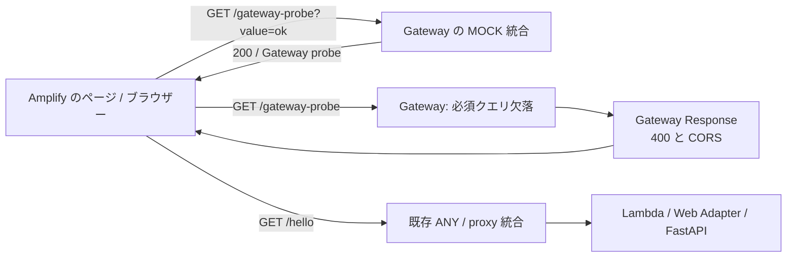
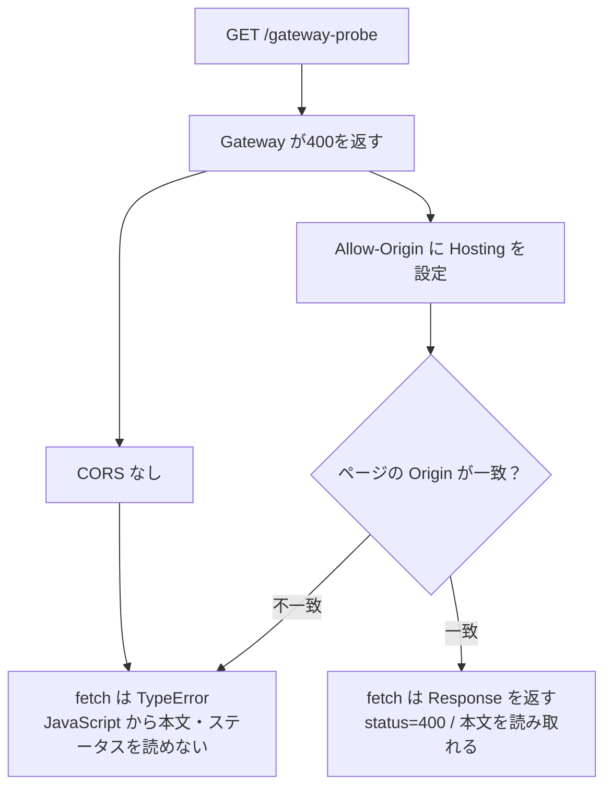

# Gateway が生成するエラーの CORS

## 目次

- [対象と結論](#対象と結論)
- [Gateway だけでエラーを再現する構成](#gateway-だけでエラーを再現する構成)
- [CORS の設定と読み取り](#cors-の設定と読み取り)
- [設定前後を比較する手順](#設定前後を比較する手順)
- [適用範囲とまとめ](#適用範囲とまとめ)

## 対象と結論

Gateway が生成する400には、FastAPI の CORS 設定が適用されません。Terraform の `aws_api_gateway_gateway_response` で、Gateway 自身のエラー応答を設定します。

- 対象: 既存の sandbox ステージ内で、必須クエリを省略して呼ぶケース。
- エラー種別: `BAD_REQUEST_PARAMETERS`。今回は必須クエリ欠落による400です。
- 許可 Origin: Terraform が取得する Amplify Hosting の Origin 一つ。
- 比較: CORS なしでは fetch が失敗し、追加後はステータスと本文を読み取れるか確認。
- 対象外: スロットリング、Lambda 統合障害、認証、credentials、プリフライトの許可。

認証を追加しなくても Gateway 自身の検証エラーを再現できます。[Gateway のエラー種別](https://docs.aws.amazon.com/apigateway/latest/developerguide/supported-gateway-response-types.html)では、リクエストパラメーター検証の失敗がこの種別に含まれます。

## Gateway だけでエラーを再現する構成

`/gateway-probe` の GET に、必須クエリ `value` の検証を設定します。Lambda や FastAPI に障害を起こす必要はありません。



- 検証パス: 明示的な `/gateway-probe` のリソースを作成。
- `GET /gateway-probe?value=ok`: Gateway の MOCK 統合が `{"message":"Gateway probe"}` を返す。正常応答の CORS も Hosting の Origin に固定。
- `GET /gateway-probe`: 必須クエリの検証で Gateway が400を生成。
- 既存の `{proxy+}`: 未定義のパスに加え、検証パスの未定義 POST も FastAPI へ転送されることを観測。この構成では未定義メソッドによる403を使わず、Gateway のパラメーター検証で再現。
- 正常への切り替え: 400の後に必須クエリ付き GET を呼び、200の本文が読めることを確認。
- パラメーター検証: `value` の存在・空でないことを検証。型・値の形式は検証しません。[AWS のリクエスト検証](https://docs.aws.amazon.com/apigateway/latest/developerguide/api-gateway-method-request-validation.html)を参照。
- 更新の公開: 検証パス・パラメーター検証・Gateway Response の定義を deployment の hash に含め、変更時に snapshot を更新。

必須クエリの有無にかかわらず、この GET は Lambda を呼び出しません。アプリ側の相関 ID `X-Request-Id` も付きません。

## CORS の設定と読み取り

### 設定前後の違い

ブラウザーは400だから fetch を失敗させるのではなく、CORS の許可がないため本文を公開しません。



- CORS あり: `Access-Control-Allow-Origin` に Hosting の Origin を設定。
- 追跡: `Access-Control-Expose-Headers` に `x-amzn-RequestId` を指定し、JavaScript から Gateway の ID を読めるようにする。
- 本文: 固定の説明、`type`、Gateway の `request_id` を返す。Lambda の request ID とは別物。
- CORS なし: AWS 既定の `{"message":"Missing required request parameters: [value]"}` を返すが、Hosting の JavaScript からは読めない。
- credentials: 許可ヘッダーを追加しない。テストも `credentials: 'omit'`。

### 固定 Origin の意味

今回は Gateway と MOCK の CORS を Hosting の一つの Origin に固定します。

- 未許可 Origin や Origin なしの HTTP リクエストにも、同じ Hosting の許可ヘッダーが付きます。
- 未許可のページでは値が自身の Origin と一致しないため、ブラウザーが読み取りを拒否します。
- FastAPI は許可一覧を判定してヘッダーを付けるため、挙動は同じではありません。
- `allowed_origins` は FastAPI 用の追加許可一覧です。Gateway の400と MOCK 応答は localhost を許可しません。
- 複数 Origin をカンマ区切りで返したり、受信した Origin を無条件に反射したりしません。

独自ヘッダーを付けない単純な GET を使用し、プリフライトと本リクエストの失敗を分けます。検証パスには OPTIONS を定義していないため、`Authorization` や独自ヘッダーを付けた通信は今回の許可対象ではありません。

## 設定前後を比較する手順

### 前提と通常の更新

以下はリポジトリのルートで実行します。既存の app・Hosting・配信済み画面が必要です。

- AWS: 使用するプロファイルで SSO ログイン済み。
- 既存設定: 個別 tfvars で、現在の `enable_error_endpoints`・`allowed_origins` などを維持。
- イメージ: `infra/app/image-uri.txt` に現在デプロイしている digest を設定。
- 依存: e2e の npm 依存と Chromium をセットアップ済み。
- 変更範囲: [AWS 設定だけの更新](deployment.md#aws-の設定だけを変更する)。Docker のビルド・push、画面の再ビルド・再公開は不要。

### 1. CORS なしを比較する

比較検証が必要なときだけ `enable_gateway_error_cors=false` を渡します。既存の同種エラー応答も一時的に CORS なしになるため、検証時間中のブラウザー通信に影響します。

```sh
terraform -chdir=infra/app plan \
  -var="image_uri=$(cat infra/app/image-uri.txt)" \
  -var=enable_gateway_error_cors=false -out=gateway-baseline.tfplan
terraform -chdir=infra/app apply gateway-baseline.tfplan

AWS_API_BASE_URL="$(terraform -chdir=infra/app output -raw api_base_url)" \
HOSTING_BASE_URL="$(terraform -chdir=infra/app output -raw hosting_url)" \
EXPECT_GATEWAY_CORS=false \
  npm --prefix e2e run test:hosting -- gateway.spec.ts
```

- plan: Gateway の検証パス・公開設定だけの変更であることを確認してから apply。
- 公開への反映: apply 直後は以前の設定が応答する場合があります。公開 URL の応答が切り替わってから比較します。
- HTTP: GET の400本文が存在し、許可ヘッダーがないことを確認。
- ブラウザー: Hosting から本文を読めず、必須クエリ付き GET へ切り替えると読めることを確認。

### 2. CORS を追加して確認する

`enable_gateway_error_cors` の既定は `true` です。比較用の `false` を外して適用します。

```sh
terraform -chdir=infra/app plan \
  -var="image_uri=$(cat infra/app/image-uri.txt)" -out=app.tfplan
terraform -chdir=infra/app apply app.tfplan

AWS_API_BASE_URL="$(terraform -chdir=infra/app output -raw api_base_url)" \
HOSTING_BASE_URL="$(terraform -chdir=infra/app output -raw hosting_url)" \
  npm --prefix e2e run test:hosting -- gateway.spec.ts hello.spec.ts api.spec.ts
```

- HTTP: 400・固定 Origin・Gateway のエラー種別と request ID を確認。
- ブラウザー: Hosting は400本文を読め、未許可 Origin は読めないことを確認。
- 既存 API: Hello World の取得と Lambda の ID を確認。
- 最後: 同じ変数で再 plan し、差分がないことを確認。個別 tfvars に比較用の `false` を残さない。

### 画面記録とテストの範囲

結果は `e2e/playwright-report/` と `e2e/test-results/` に保存します。

- ブラウザー結合: 配信済みページの Origin から実 API に fetch。結果をテスト専用パネルに表示し、開始・400/CORS拒否・必須クエリ付き GET の PNG を添付。
- 未許可 Origin: テストが未許可サイトのページだけを用意。AWS の応答は差し替えない。
- HTTP 結合: 実際の400と CORS ヘッダーを確認。画面キャプチャは対象外。
- このテストは React のエラー表示機能の E2E ではなく、Gateway とブラウザーの CORS 判定の結合テスト。

## 適用範囲とまとめ

確認するのは、既存ステージ内の必須クエリ欠落に対する400です。

- `BAD_REQUEST_PARAMETERS` の Gateway Response は同じ API の同種エラーに適用されます。検証パスだけに限定する設定ではありません。
- 存在しないステージ・別 API・DNS/TLS の失敗は、この設定の検証範囲ではありません。
- `DEFAULT_4XX` / `DEFAULT_5XX` は未追加。他のエラー種別へ一括適用しません。
- タイムアウト、呼び出し権限不足、不正な Lambda 応答、スロットリングは別の PoC。

Gateway の400と FastAPI のエラーを分け、CORS の設定前後でブラウザーの読み取りを比較します。仕様は [AWS の Gateway Response](https://docs.aws.amazon.com/apigateway/latest/developerguide/api-gateway-gatewayResponse-definition.html)と [Terraform のリソース定義](https://registry.terraform.io/providers/hashicorp/aws/6.67.0/docs/resources/api_gateway_gateway_response)を参照してください。
