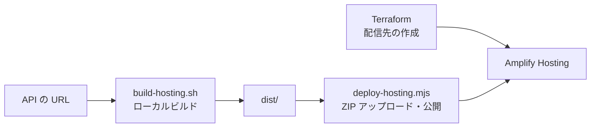

# フロントエンド

## 目次

- [概要](#概要)
- [開発環境](#開発環境)
- [開発と動作確認](#開発と動作確認)
- [チェックとビルド](#チェックとビルド)
- [Amplify への手動デプロイ](#amplify-への手動デプロイ)
- [依存インストールの設定](#依存インストールの設定)
- [操作のまとめ](#操作のまとめ)

## 概要

React の画面から FastAPI を直接呼び、取得結果や通信失敗を表示します。

- React: 画面と状態管理。
- TypeScript 7: 型検査。
- Vite+: 開発サーバー、lint、ビルド。

以下のコマンドは、すべて `frontend/` 内で実行します。

## 開発環境

### 必要なツール

- Node.js: `24` 以上。Vite+ の条件により、24系は `24.11.0` 以上。
- npm: `11.17.0` 以上。
- API の起動: [backend の手順](../backend/README.md)を参照。

### セットアップ

lockfile に記録した依存をインストールします。

```sh
npm ci
```

- 直接依存: `package.json` で完全なバージョンを指定。
- 間接依存: `package-lock.json` で固定。
- Vite+: ローカル依存を使うため、グローバルインストールは不要。

## 開発と動作確認

### 開発サーバー

```sh
npm run dev
```

- 画面: `http://localhost:5173`。
- 初期表示: `Hello World`。
- 「API を呼び出す」: バックエンドの `/hello` を取得。
- 成功時: `API: Hello World` を表示。
- 失敗時: エラーを表示し、ボタンから再試行可能。
- 終了: `Ctrl+C`。

API 呼び出しを確認する前に、別ターミナルでバックエンドを起動してください。

### エラーレスポンスの検証

「エラーレスポンスの CORS 検証」でケースを選び、実 API のエラー応答を確認できます。

- 前提: backend の `ENABLE_ERROR_ENDPOINTS=true`。AWS では [API の設定](../infra/app/README.md#エラー検証-api-と追加-origin)を使用。
- 読み取り成功: HTTP ステータス・本文・Request ID、429では Retry-After を表示。
- 読み取り失敗: CORS または通信状態の確認を案内。fetch の例外だけでは原因を断定しません。
- プリフライト: 許可 GET、未許可ヘッダー、未許可 PUT を選択可能。
- 未許可 Origin: `http://127.0.0.1:5173` は許可対象外。両ホスト名で開く場合は `npm run dev -- --host 127.0.0.1` で起動。
- 再試行: 別のケースを選んで同じボタンから実行可能。

HTTP エラーも本文を表示するため、CORS 拒否による読み取り失敗との違いを確認できます。

### 接続先の設定

`VITE_API_BASE_URL` で API の接続先を変更できます。既定値は `http://localhost:8000` です。

```sh
cp .env.example .env.local
```

1. `.env.local` の `VITE_API_BASE_URL` を編集します。
2. 開発サーバーを再起動します。

- この値はビルド時にフロントへ取り込まれ、ブラウザーに公開されます。
- 秘密情報は設定しません。
- ローカルの既定の許可 Origin は `http://localhost:5173`。画面を `127.0.0.1` で開くと別 Origin になります。
- Amplify 配信時: [app の Terraform](../infra/app/README.md#エラー検証-api-と追加-origin)が配信先 Origin を自動追加。
- Vite プロキシと credentials は使用しません。

## チェックとビルド

### 型検査・lint

```sh
npm run check
```

- `tsc --noEmit`: TypeScript 7 の型検査。
- `vp lint`: Vite+ の lint。

### ビルド

```sh
npm run build
```

- 型検査後、Vite+ でビルドします。
- 成果物は `dist/` に出力します。
- ブラウザーテストは [e2e の手順](../e2e/README.md)で実行します。

## Amplify への手動デプロイ

### 準備と公開の流れ

ローカルでビルドした `dist/` を手動で公開します。Terraform にデプロイ処理は含めません。



- 前提: [アプリのリソース作成](../infra/app/README.md)を完了。Hosting の Origin は Terraform が自動で許可。
- 認証: SSO ログイン済み。`AWS_PROFILE` は実行環境で指定。
- ツール: Node.js・npm、Terraform、AWS CLI v2、`zip`。
- 手動公開: Git push や Terraform apply では画面を更新しません。

### 配信用ビルド

```sh
./scripts/build-hosting.sh
# API URL を明示する場合
./scripts/build-hosting.sh 'https://example.execute-api.us-east-1.amazonaws.com/sandbox'
```

- API URL: 省略時は `infra/app` の Terraform output を使用。
- 出力: `dist/`。ビルド時の接続先が JS に埋め込まれます。
- API の作成・更新、Hosting への公開: このスクリプトは実行しません。
- 公開値: フロントの環境変数に秘密情報を入れません。
- 通常の `npm run build`: 接続先を指定しなければ localhost が既定。AWS 配信用には上記スクリプトを使用。

### 成果物の公開

```sh
node scripts/deploy-hosting.mjs
```

- 入力: 作成済みの `dist/`。ビルドを自動実行しません。
- 配信先: `infra/app` の Terraform output から app・branch・region を取得。
- ZIP: `index.html` と assets をアーカイブ直下へ格納。`dist/` ディレクトリ自体は含めません。
- 順序: ジョブ作成 → ZIP の PUT → 公開開始 → 完了待機。
- 失敗: アップロード失敗時は公開を開始せず、配信失敗・待機上限は非0で終了。
- 待機: 5秒間隔、最大120回。上限超過はジョブ停止ではありません。Amplify で状態を確認。
- 一時ファイル: ZIP を終了・失敗・中断時に削除。署名付きアップロード URL は表示・保存しません。
- 更新: API URL または画面を変えたら、再ビルドして手動公開。
- 配信済み画面の検証: [e2e の Hosting テスト](../e2e/README.md#amplify-配信済み画面のテスト)。

仕様の参照: [Amplify の手動デプロイ](https://docs.aws.amazon.com/amplify/latest/userguide/manual-deploys.html)。

### スクリプトのローカルテスト

```sh
npm run test:scripts
```

- `unzip` も使用して、実際の ZIP 直下に `index.html` があることを確認。
- AWS への接続は置き換え、引数・公開順序・アップロード失敗時の停止・一時ファイル削除を確認。

ビルドと公開は別々に実行し、公開済みの HTTPS 画面は Playwright で確認します。

## 依存インストールの設定

`.npmrc` で自動スクリプトと公開直後の依存解決を制限しています。

- `ignore-scripts=true`: install/postinstall 等を自動実行しません。
- `min-release-age=7`: 依存解決時に公開後7日未満のバージョンを除外します。
- `save-exact=true`: 追加する直接依存を完全なバージョンで保存します。
- `engine-strict=true`: 依存が要求するランタイム条件を確認します。

`npm run` で指定したスクリプトは実行できます。付随する pre/post は実行しません。

## 操作のまとめ

- セットアップ: `npm ci`。
- 開発: バックエンドを起動し、`npm run dev`。
- 検証: `npm run check` と `npm run build`。
